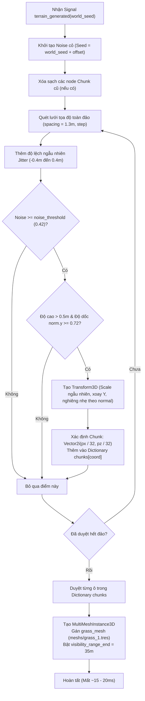

# Kế Hoạch Triển Khai Hệ Thống Cỏ Đa Phân Vùng (Chunked MultiMesh Grass System)

Tài liệu này vạch ra kiến trúc chi tiết, thiết kế thuật toán và các bước triển khai hệ thống thảm cỏ **Chunked MultiMesh Grass** tối ưu cho dự án **Mucs** (Godot 4, bản đồ địa hình 256m x 256m, card đồ họa Intel Iris Xe).

---

## 1. Mục Tiêu & Yêu Cầu Kỹ Thuật

- **Mật độ & Thẩm mỹ**: Tạo thảm cỏ tự nhiên, dày dặn, mọc thành từng cụm/vạt ngẫu nhiên quanh các sườn đồi và bãi bằng.
- **Tối ưu GPU tuyệt đối**: Đảm bảo game chạy ổn định 60 FPS trên card onboard Intel Iris Xe bằng cơ chế **Chunk-based GPU Distance Culling** (`visibility_range_end`).
- **Đồng bộ thế giới**: Tự động sinh đồng bộ theo `world_seed` từ node [Terrain](file:///d:/Godot/mucs/scripts/terrain.gd#L4) (`terrain_generated`).
- **Không tốn tài nguyên vật lý**: Cỏ là vật thể trang trí thuần túy (không sinh `CollisionShape3D` hay `StaticBody3D`).

---

## 2. Kiến Trúc Hệ Thống (Architecture Design)

```
Terrain (Node: MeshInstance3D)
  └── ChunkedGrass (Node: Node3D, script: grass.gd)
        ├── Chunk_0_0 (MultiMeshInstance3D) -> Cull nếu xa > 35m
        ├── Chunk_0_1 (MultiMeshInstance3D) -> Cull nếu xa > 35m
        ├── Chunk_1_0 (MultiMeshInstance3D) -> Cull nếu xa > 35m
        └── ... (Tổng cộng 64 chunks cho đảo 256m)
```

### Nguyên lý hoạt động:
1. **Kích thước Chunk**: Mỗi ô có kích thước `32.0m x 32.0m`.
2. Với địa hình kích thước `256m x 256m`, bản đồ được chia thành lưới `8 x 8 = 64 ô chunk`.
3. Mỗi ô chunk quản lý một node `MultiMeshInstance3D` riêng biệt.
4. Mỗi node chunk được bật các thông số culling của Godot 4:
   - `visibility_range_end = 35.0` mét.
   - `visibility_range_end_margin = 8.0` mét.
   - `visibility_range_fade_mode = GeometryInstance3D.VISIBILITY_RANGE_FADE_SELF`.
5. **Hiệu quả**: Khi Camera di chuyển, GPU chỉ phải xử lý và vẽ các chunk nằm trong bán kính 35m (~4 đến 9 chunk, tương đương khoảng 2.000 – 3.500 bụi cỏ). Hơn 55 chunk ở xa bị GPU triệt tiêu 100% chi phí vertex/fragment shader.

---

## 3. Thiết Kế Thuật Toán (Step-by-Step Algorithm)



---

## 4. Bảng Tham Số Cấu Hình (Inspector Export)

| Thuộc tính | Kiểu dữ liệu | Giá trị đề xuất | Mô tả chi tiết |
| :--- | :--- | :--- | :--- |
| `spacing` | `float` | `1.3` | Khoảng cách mắt lưới cơ bản (mét). Càng nhỏ cỏ càng rậm. |
| `jitter` | `float` | `0.45` | Độ lệch ngẫu nhiên để tránh cỏ mọc thẳng hàng bàn cờ. |
| `chunk_size` | `float` | `32.0` | Kích thước mỗi khối chunk (mét). |
| `grass_mesh` | `Mesh` | `res://meshs/grass_1.tres` | Mesh 3D của bụi cỏ. |
| `min_slope` | `float` | `0.72` | Ngưỡng độ dốc tối thiểu (`norm.y`), tránh cỏ mọc trên vách đá đứng. |
| `min_height` | `float` | `0.4` | Độ cao tối thiểu so với mặt biển để tránh mọc dưới nước. |
| `y_offset` | `float` | `-0.05` | Cắm nhẹ gốc cỏ xuống đất để không hở đáy. |
| `noise_threshold` | `float` | `0.42` | Ngưỡng mọc theo noise để tạo các thảm/vạt cỏ cô đọng tự nhiên. |
| `visibility_range_end` | `float` | `35.0` | Khoảng cách tối đa nhìn thấy ngọn cỏ (mét). |
| `visibility_range_end_margin`| `float` | `8.0` | Khoảng cách mờ dần dither fade khi lại gần / ra xa. |
| `min_scale` / `max_scale` | `float` | `0.85` / `1.3` | Tỉ lệ to nhỏ ngẫu nhiên của các khóm cỏ. |

---

## 5. Kế Hoạch Thực Hiện Chi Tiết (Action Plan)

### Giai đoạn 1: Chuẩn bị & Viết Script (`scripts/grass.gd`)
1. Viết lại hoàn chỉnh script [scripts/grass.gd](file:///d:/Godot/mucs/scripts/grass.gd) kế thừa `Node3D`.
2. Khai báo các biến `@export` có phân nhóm `@export_group` rõ ràng.
3. Cài đặt hàm `generate_grass(world_seed: int)` chia bucket theo dictionary `Dictionary[Vector2i, Array[Transform3D]]`.
4. Cài đặt hàm tạo `MultiMeshInstance3D` cho từng ô chunk kèm thiết lập `visibility_range_*`.

### Giai đoạn 2: Tích hợp vào Scene & Lắng nghe Signal
1. Đảm bảo node `Grass` được đặt dưới node `Terrain` trong Scene.
2. Trong hàm `_ready()`, tự động kết nối với signal `terrain_generated(world_seed)` của node [Terrain](file:///d:/Godot/mucs/scripts/terrain.gd).
3. Hỗ trợ tự sinh lại cỏ khi thay đổi tham số trong Editor (`@tool` hoặc export button).

### Giai đoạn 3: Kiểm thử & Đo lường hiệu năng
1. Chạy game kiểm tra thời gian sinh cỏ (kỳ vọng: `< 25ms` khi load map).
2. Di chuyển nhân vật khắp đảo để kiểm tra:
   - Các chunk cỏ ở xa có tự ẩn không.
   - Khi tiến lại gần cỏ có hiện ra mượt mà không (Dither Alpha Fade).
   - Kiểm tra FPS xem có giữ vững 60 FPS trên card Intel Iris Xe không.
3. Kiểm tra xem cỏ có bị mọc dưới nước hoặc trên vách đá dựng đứng hay không.

---

## 6. Tiêu Chí Đánh Giá Thành Công (Definition of Done)

- [ ] Toàn bộ đảo có thảm cỏ xanh mọc tự nhiên thành từng vạt.
- [ ] Không có ngọn cỏ nào mọc dưới đáy biển hoặc vách đá dựng đứng.
- [ ] Số lượng bụi cỏ hiển thị đồng thời trên GPU luôn duy trì dưới **4.000 bụi**.
- [ ] FPS game ổn định tuyệt đối (không bị drop frame hay treo GPU).
- [ ] Hoàn toàn đồng bộ theo seed thế giới (cùng seed thì vị trí cỏ không đổi).
