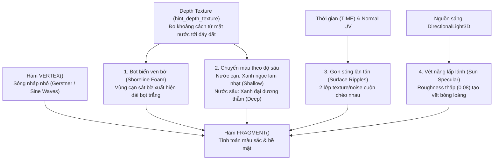

# Kế Hoạch Triển Khai Hệ Thống Nước / Đại Dương (Water & Ocean Plan)

Tài liệu này vạch ra kế hoạch chi tiết, kiến trúc kỹ thuật và các bước thực hiện để thêm mặt nước biển bao quanh hòn đảo trong dự án **Mucs** (Godot 4, card đồ họa Intel Iris Xe).

---

## 1. Phân Tích Hiện Trạng Địa Hình

- **Mực nước chuẩn**: Theo cấu hình trong [terrain.gd](file:///d:/Godot/mucs/scripts/terrain.gd#L45-L48), mặt nước biển được quy ước nằm cố định tại tọa độ:
  $$\mathbf{Y = 0.0}$$
- **Bán kính đảo**: `island_radius = 120.0m`.
- **Đáy biển**: Ngoài bán kính 120m, địa hình chìm xuống đáy biển với độ sâu `sea_depth = 8.0m` (tọa độ $Y = -8.0$).
- **Vật thể trên bờ**: Cây, đá và cỏ đều đã được cấu hình mọc từ $Y \ge 0.4m$ trở lên, tạo nên một dải bờ cát/mép nước tự nhiên ở cao độ từ $0.0m$ đến $0.5m$.

---

## 2. Kiến Trúc Node Trong Scene

Mặt nước sẽ được cấu hình thành một Node riêng biệt trong Scene chính (`game.scn`), không phụ thuộc vào script Terrain:

```text
Game (Node3D)
  ├── Terrain (MeshInstance3D)
  │     ├── FoliageManager (Node3D)
  │     └── Grass (Node3D)
  └── Ocean / Water (MeshInstance3D)
        ├── Mesh: PlaneMesh (Kích thước 512m x 512m, Subdivide 64 x 64)
        ├── Transform: Position (0, 0, 0)
        ├── Material: ShaderMaterial (res://shader/water.gdshader)
        └── WaterArea (Area3D) [Tùy chọn: Nhận diện bơi / rơi xuống nước]
              └── CollisionShape3D: BoxShape3D (Nằm từ Y = 0 trở xuống)
```

---

## 3. Thiết Kế Shader Mặt Nước (`shader/water.gdshader`)

Để vừa đạt thẩm mỹ cao (phù hợp với phong cách Stylized của cây/đá/cỏ), vừa nhẹ và mượt mà trên card **Intel Iris Xe**, shader nước sẽ được thiết kế với 4 hiệu ứng cốt lõi:



### Các tính năng chính trong Shader:
1. **Chuyển màu theo độ sâu (Depth-based Color Transition)**:
   - Sử dụng `hint_depth_texture` của Godot 4 để đo khoảng cách từ mặt nước tới đáy biển.
   - Vùng cạn sát bờ cát: Màu xanh ngọc lam trong trẻo (*Turquoise Shallow*).
   - Vùng biển xa và sâu: Chuyển dần sang xanh đại dương thẫm (*Deep Ocean Blue*).
2. **Dải bọt sóng ven bờ (Shoreline Foam)**:
   - Ngay tại vị trí mặt nước giao thoa với dốc cát của đảo (chênh lệch độ sâu $< 0.3m$), shader tự động vẽ một dải bọt trắng mềm mại chuyển động nhẹ.
3. **Sóng nhấp nhô vật lý (Vertex Wave Displacement)**:
   - Dùng 2 hàm sóng sine lệch pha cuộn theo `TIME` trong hàm `vertex()` để các đỉnh lưới nước dập dềnh nhẹ nhàng.
4. **Gợn sóng lăn tăn & Phản chiếu nắng (Normal Ripples & Sun Specular)**:
   - Tạo gợn sóng lấp lánh phản chiếu ánh mặt trời (`ROUGHNESS = 0.08`, `SPECULAR = 0.5`).

---

## 4. Tương Tác Gameplay (Water Physics & Player Area)

Thêm một `Area3D` với `CollisionShape3D` dạng hộp (BoxShape3D):
- Kích thước: `512m x 16m x 512m`.
- Vị trí: Tâm tại `(0, -8, 0)` (chiếm trọn toàn bộ khối nước từ mực $Y = 0.0$ trở xuống).
- Công dụng:
  - Bắt sự kiện khi `Player` rơi khỏi đảo và chạm vào nước (`body_entered`).
  - Có thể kích hoạt hiệu ứng bắn nước (Splash particles), chuyển trạng thái bơi (swimming) hoặc hồi sinh Player trở lại bờ đảo.

---

## 5. Bảng Tham Số Cấu Hình Inspector Của Shader

| Tên Uniform | Kiểu dữ liệu | Giá trị đề xuất | Ý nghĩa |
| :--- | :--- | :--- | :--- |
| `shallow_color` | `Color` | `#1fc2b8` (Xanh ngọc lam) | Màu nước ở vùng cạn gần bờ đảo. |
| `deep_color` | `Color` | `#0b3d68` (Xanh thẫm) | Màu nước ở vùng biển sâu. |
| `depth_distance` | `float` | `4.0` | Khoảng cách độ sâu để nước chuyển màu hoàn toàn sang màu thẫm. |
| `foam_color` | `Color` | `#f0f8ff` (Trắng bọt biển) | Màu của dải bọt sóng sát mép bờ. |
| `foam_distance` | `float` | `0.35` | Độ rộng của dải bọt trắng ven mép cát. |
| `wave_height` | `float` | `0.15` (mét) | Biên độ sóng nhấp nhô (tránh làm quá to gây tràn lên đỉnh đảo). |
| `wave_speed` | `float` | `1.2` | Tốc độ cuộn của sóng biển. |
| `roughness` | `float` | `0.08` | Độ bóng loáng của mặt nước. |

---

## 6. Kế Hoạch Triển Khai Từng Bước (Action Plan)

### Bước 1: Viết Shader Nước (`shader/water.gdshader`)
- Viết shader hoàn chỉnh hỗ trợ depth gradient, shoreline foam, vertex displacement và normal wave animation.

### Bước 2: Tạo Mesh Mặt Nước Trong Scene
- Tạo node `Ocean` (loại `MeshInstance3D`) trong `scenes/game.scn`.
- Gán `PlaneMesh` kích thước `512m x 512m` với `subdivide = 64` hoặc `96`.
- Đặt tọa độ tại `(0.0, 0.0, 0.0)`.
- Gán `ShaderMaterial` sử dụng `res://shader/water.gdshader`.

### Bước 3: Kiểm Thử & Tinh Chỉnh Thẩm Mỹ
- Chạy thử game kiểm tra dải bọt nước tiếp giáp với bờ cát của đảo.
- Tinh chỉnh màu sắc (`shallow_color`, `deep_color`) để hài hòa tuyệt đối với màu cỏ và địa hình của đảo.
- Kiểm tra hiệu năng FPS trên card Intel Iris Xe (đảm bảo giữ vững 60 FPS).
